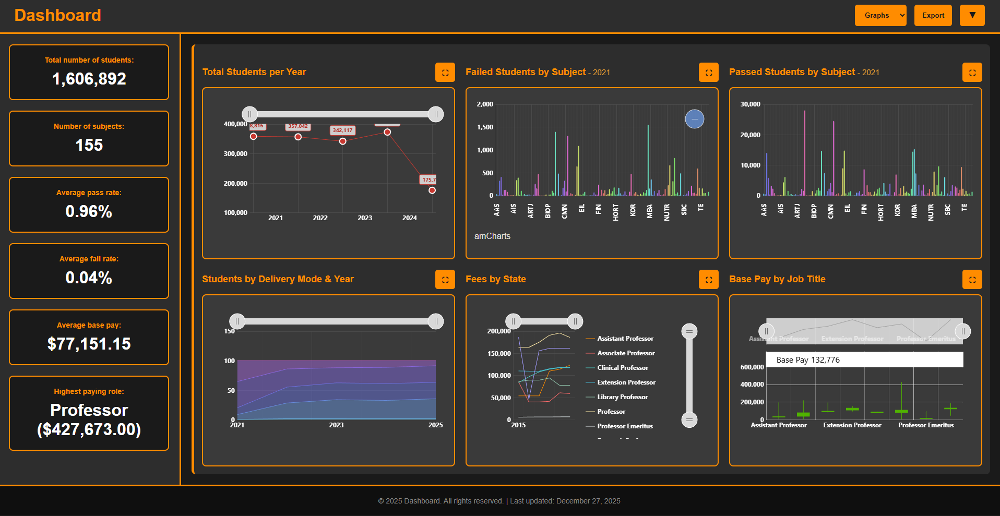
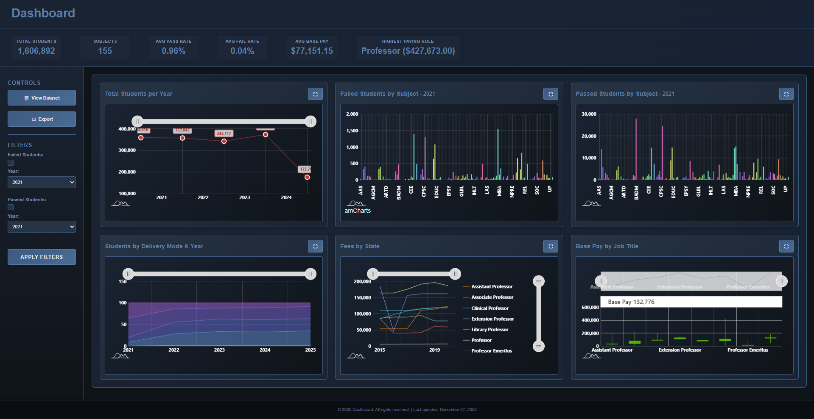
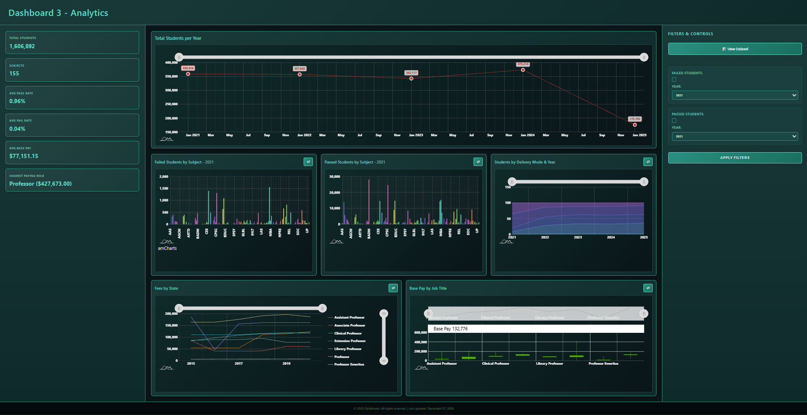

# 📊 Data Visualization Dashboard

An interactive web-based dashboard designed to visualize complex datasets through multiple dynamic charts, enabling clear insights and data-driven decision-making.

> 📌 Developed by **Omar Ashraf Mahmoud** & teammate  
> 🎨 Omar: Frontend development, dashboard design, and chart ideation  
> 📊 Teammate: Data collection and preprocessing  

---

## 🔍 Features

### 🖥️ Dashboard Interface
- Clean and responsive UI built with HTML, CSS, and JavaScript  
- Multiple interactive charts displayed in a unified dashboard  
- Smooth navigation and structured layout for easy insight extraction  

### 📊 Data Visualization
- Built using **amCharts** for rich and interactive visuals  
- Includes multiple chart types:
  - Bar Charts  
  - Line Charts  
  - Pie Charts  

### 🎨 Multiple Layout Designs
- Designed **3 different dashboard layouts**  
- Each layout explores a different approach to:
  - Data organization  
  - Visual hierarchy  
  - User experience  

---

## 🚀 Live Demo

🌐 **View the dashboard here:**  
👉 https://omar-astro.github.io/Dashboard-Demo/

---

## 🚀 Main Project Files

### 📁 Frontend
- `index.html` – Main dashboard structure  
- `style.css` – Styling and layouts  
- `script.js` – Chart logic and interactivity  

> ⚠️ Note: The data preprocessing notebook is not included, as it was lost during development.

---

## ⚙️ How to Run the App

### 💻 Run Locally

#### Requirements
- Any modern web browser (Chrome recommended)

#### Steps
1. Clone or download the repository  
2. Open `index.html` in your browser  
3. Explore the dashboard and interact with charts  

---

## ⚠️ Notes & Tips

- Ensure JavaScript is enabled in your browser  
- For best performance, use modern browsers (Chrome recommended)  
- Large datasets may slightly affect loading speed  

---

## 📸 Screenshots

### 🧭 Dashboard Overview
Displays one of the dashboard layouts with multiple charts and insights.

---

### 🎨 Alternative Layout
A different layout showcasing another design approach.

---

### 📊 Third Layout Design
A third variation focusing on structure and readability.

---

## 👤 Author

**Omar Ashraf Mahmoud**  
🎓 Computer Science Major – Data Science & Artificial Intelligence (DSAI)  
🏫 Zewail City of Science and Technology  
🆔 Student ID: 202400725  
📧 College Email: s-omar.amahmoud@zewailcity.edu.eg  
📬 Personal Email: omar.ashraf.hamed2017@gmail.com  

---

## 📄 License

This project is licensed under the [MIT License](./LICENSE).  
Feel free to use, modify, and build upon this work — just make sure to give credit to the original author.

---

<!-- Clean UI • Data Storytelling • Frontend Engineering -->
